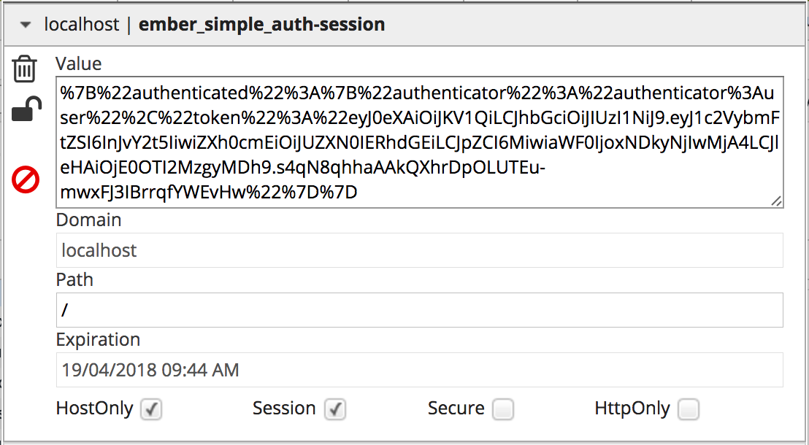
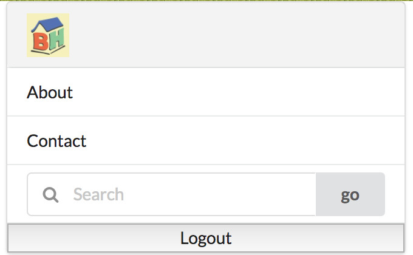

# Share authentication between ember apps #

Now it is most interest part so far for this project. How do we share the user auth so all ember apps under this domain can use it?
 
## Authentication steps ##

As we did in user authentication, I would like to separate it into two steps:

- Read session for user auth token and decided if user is logged-in or not.

- Login user: contact remote authentication server to get user token.

I expect we should do first step.
 
## Add user session support in ember-app ##
- Install ember-simple-auth to ember-app and ember-admin
```aidl
$ember install 
```
- Create application controller
```aidl
// ember-app
$ ember g controller application
```

- Then add session in it.
```aidl
// ember-app/app/controllers/application.js
import Ember from 'ember';

export default Ember.Controller.extend({
  session: Ember.inject.service('session')
});

```

- Now in template of application.hbs, add check for user login.
```aidl
// ember-app/app/templates/application.hbs

    {{#if session.isAuthenticated}}
      <button {{action 'logout'}}>Logout</button>
    {{else}}
      <button {{action 'login'}}>Login</button>
    {{/if}}
    
```

- Since we use action, let's create application.js route and add actions
```aidl
// ember-app/routes/application.js
import Ember from 'ember';
import ApplicationRouteMixin from 'ember-simple-auth/mixins/application-route-mixin';
export default Ember.Route.extend(ApplicationRouteMixin, {
  actions: {
    logout: function() {
      this.get('session').invalidate();
    },
    login: function() {
      window.location.replace("/user/");
    }
  }
});

```

### Let's test it ###

- Login to http://localhost:8080/user, I can see 'logout' button. I was logged in.
- Switch to http://localhost:8080/app. I see the page menu bar, it show 'login'.

Does not work yet. What is happened?

- Yep, after check the cookie, it did not looks like has full authentication token in the cookie yet.
 See following image. The cookie is too short.
 


- By default ember use local storage store for session. It is not sharable between embers. Let's add cookie store.
Following by this doc: [CookieStore](https://ember-simple-auth.com/api/classes/CookieStore.html)

Important thing is session-stores, we need add CookieStore so ember will use it. We need to do it in all Ember apps.

```aidl
$ cd app
$ mkdir session-stores
$ touch application.js
```
Then let's modify the code /app/session-stores/application.js
```aidl
// app/session-stores/application.js
import CookieStore from 'ember-simple-auth/session-stores/cookie';

export default CookieStore.extend();
```

### Rebuild all ember apps. ###
 Run `ember build` for all ember apps.
 
### Let's test it again ###

- Login to http://localhost:8080/user, I can see 'logout' button. I was logged in.
- Switch to http://localhost:8080/app. I see the page menu bar, it show 'login'.

Still does not work! But good is I see the auth cookie in both /user and /app. A little progress.
 


Now what is next?

### Restore session from cookie ###

Read ember-user authenticators/user.js, it has a method 'restore'. 

Read document [BaseAuthenticator](https://ember-simple-auth.com/api/classes/BaseAuthenticator.html), it has following statement.

```aidl
The authenticator also decides whether a set of data that was restored from the session store (see restore) makes up an authenticated session or not.
```

Guess what was happened, the /app should restore the user auth from cookie store in order to get session token. So we should add authenticator to make it.

In ember-app, add app/authenticator/user.js

```aidl
$ ember g authenticator user
```

Let's see what is default:
```aidl
import Base from 'ember-simple-auth/authenticators/base';

export default Base.extend({
  restore(data) {
  },

  authenticate(/*args*/) {
  },

  invalidate(data) {
  }
});

```

We only want to restore the token for now, so update the restore method:
```aidl
restore: function(data) {
    return new Ember.RSVP.Promise(function(resolve, reject) {
      if (!Ember.isEmpty(data.token)) {
        resolve(data);
      } else {
        reject();
      }
    });
  },
```

### Let's test it one more time ###

- Login to http://localhost:8080/user, I can see 'logout' button. I was logged in.
- Switch to http://localhost:8080/app. I see the page menu bar, it show 'logout' !

Woo. We got it works!



## Logout ##

Now we need user could log out from anywhere.

- Solution 1: in each of app authenticator/user.js, implement invalidate method.
- Solution 2: redirect url to /user/#/logout

I will do solution 1. since we anyway need to write `restore` method, it is not hurt to fill `invalidate` method with a couple of lines.

This is the full version for the authenticator/user code.
```aidl
import Ember from 'ember';

import Base from 'ember-simple-auth/authenticators/base';

export default Base.extend({
  restore: function(data) {
    return new Ember.RSVP.Promise(function(resolve, reject) {
      if (!Ember.isEmpty(data.token)) {
        resolve(data);
      } else {
        reject();
      }
    });
  },

  authenticate(/*args*/) {
  },

  invalidate: function() {
    console.log('invalidate...');
    return Ember.RSVP.resolve();
  }
});

```

## Update admin to enable authentication as well ##

Enable the admin auth check. Also added home page menu, index, product, sale routes etc.