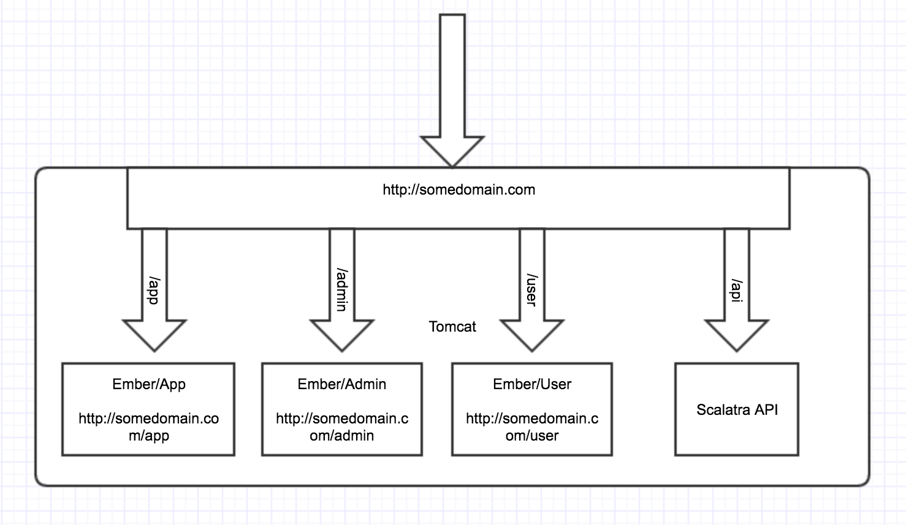
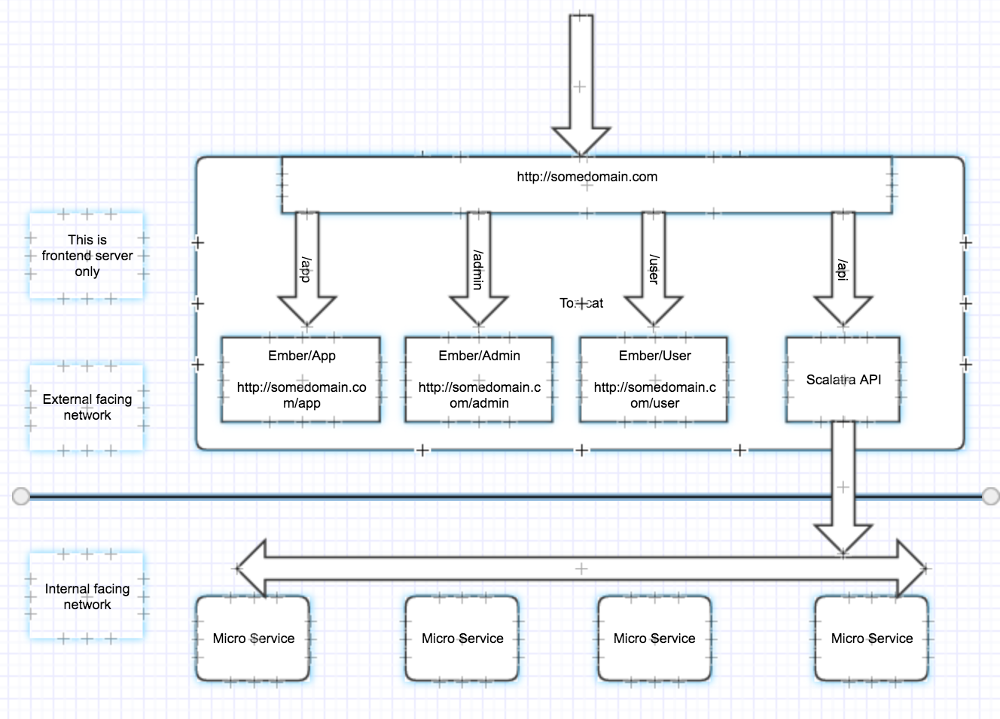

# System Architecture #

Now it is time to talk about the distribution.

First goal, we want these ember apps are able to be run under one domain. 

To archive this, we can either have them deployed into one container as different folders.

Note: From above diagram, the ScalatraApi was running in the server containers. Other ember app (/admin, /app, /user) are actually only be static files.
 
The service loading will to be: frontend ember app files downloading + api call.

Second goal: Support micro-service architecture:

As my understanding, it does not means we will breakdown the front UI into multiple micro-service.
Actually it should be lead me to thinking under the API service, the actually business logic should be implemented by multiple-services.
All these services are constructed become one system to service the front end.

So the Scalatra API layer here should be an thin-entry API service. 

For the small system, you are OK to implement the service domain logic in here.

For the large system, I would like to use this layer just take the request from frontend,
 then distribute the actually function into internal micro-services system. 
 Those micro-services are not public internet facing. And we may need less access control here. 
 

## Summary ##

- Scalatra-ember-cli projects intend to show you how we put the ember apps together for a domain's frontend server.
- The Scalatra API service work as main api service here to take request from frontend services. They should be under same domain so avoid cross-domain reference concern.
- The scalatra api service could be full function service if the main business is small, 
or it can be the entry api service to take over the client request and hand it to backend service group to performance domain functions.
- There is another option to have one ember APP + Scalatra API service together as one services. 
And all these kind of groups put together under Nginx or Apach Http with URL redirect. 
That is even bigger system architecture. I do not draw the diagram here. But you can image it just like the second diagram,
 and there are multiple these kinds of group work together under same domain with Nginx or Appach Http. 
 
 
## What is next ##

By now the first stage of this project was done. 

I am going to find time to continue work on this project to add some useful function so it may become a simple eCommerce site.

Welcome you to come back to check the progress. If you have idea what function should be added into, then let's talk about it.

## Possible function addon ##

- Implement the in-project user-authentication api service. (think about integrating with KeyCloak etc.)
- Shopping experience with backend database support
- Checkout support

# Thanks ! #